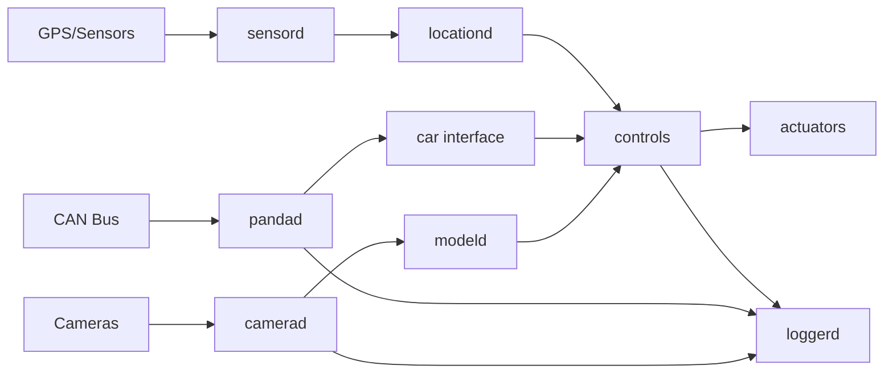

## System Overview

sunnypilot is built on top of openpilot and follows a modular, process-based architecture. The system is organized into three main component directories:

<CardGroup cols={3}>
  <Card title="selfdrive" icon="steering-wheel" iconType="solid">
    Core driving functionality including car integration, controls, planning, and perception
  </Card>
  <Card title="system" icon="microchip" iconType="solid">
    System-level services including logging, hardware abstraction, and device management
  </Card>
  <Card title="sunnypilot" icon="sun" iconType="solid">
    sunnypilot-specific features and enhancements including MADS, navigation, and custom models
  </Card>
</CardGroup>

## Component Structure

### selfdrive/

The `selfdrive` directory contains the core autonomous driving functionality:

```
selfdrive/
├── car/              # Vehicle interface and platform support
├── controls/         # Lateral and longitudinal control
├── locationd/        # GPS and localization
├── modeld/           # Driving model inference
├── monitoring/       # Driver monitoring
├── pandad/           # CAN bus communication
├── selfdrived/       # Main driving daemon
└── ui/               # User interface
```

<Accordion title="Key Components">
  <AccordionGroup>
    <Accordion title="car/">
      Vehicle-specific interfaces and implementations for 300+ supported car models. Handles CAN bus communication, fingerprinting, and platform-specific tuning.
    </Accordion>
    <Accordion title="controls/">
      Implements lateral (steering) and longitudinal (acceleration/braking) control using Model Predictive Control (MPC).
    </Accordion>
    <Accordion title="modeld/">
      Runs neural network models for driving path prediction, lane detection, and object recognition.
    </Accordion>
    <Accordion title="pandad/">
      Interfaces with the panda hardware for CAN bus reading and writing.
    </Accordion>
  </AccordionGroup>
</Accordion>

### system/

The `system` directory provides infrastructure and system services:

```
system/
├── athena/           # Cloud connectivity
├── camerad/          # Camera capture (device-specific)
├── hardware/         # Hardware abstraction layer
├── loggerd/          # Data logging and recording
├── manager/          # Process lifecycle management
├── sensord/          # Sensor data collection
└── ui/               # System UI components
```

<Info>
  The **manager** is responsible for starting, monitoring, and restarting all other processes based on their configuration in `process_config.py`.
</Info>

### sunnypilot/

The `sunnypilot` directory contains fork-specific enhancements:

```
sunnypilot/
├── common/           # Shared utilities and transformations
├── livedelay/        # Custom delay detection
├── mads/             # MADS (M.A.D.S) implementation
├── mapd/             # Map data integration
├── modeld_v2/        # Enhanced driving models
├── models/           # Custom model definitions
├── navd/             # Navigation integration
├── selfdrive/        # Extensions to core driving components
├── sunnylink/        # Cloud features
└── system/           # System-level customizations
```

## Process Architecture

### Process Manager

The system uses a centralized process manager (`system/manager/manager.py`) that:

1. Initializes device parameters and hardware
2. Registers the device with cloud services
3. Manages the lifecycle of all processes defined in `process_config.py`
4. Monitors process health and restarts failed processes
5. Handles transitions between onroad/offroad states

### Inter-Process Communication

Processes communicate using **ZeroMQ** message passing:

<Steps>
  <Step title="Messaging Layer">
    Built on `cereal` (Cap'n Proto schemas) for type-safe, efficient serialization
  </Step>
  <Step title="PubSub Pattern">
    Processes publish to named topics, others subscribe to consume messages
  </Step>
  <Step title="Message Queues">
    Shared memory queues (`msgq`) provide low-latency communication
  </Step>
</Steps>

```python
# Example: Publishing a message
import cereal.messaging as messaging

pm = messaging.PubMaster(['carState'])
pm.send('carState', msg)

# Example: Subscribing to messages
sm = messaging.SubMaster(['carState', 'controlsState'])
sm.update()
car_state = sm['carState']
```

## Build System

sunnypilot uses **SCons** as its build system:

- Main build configuration: `SConstruct`
- Component builds: `SConscript` files in each directory
- Supports multiple architectures: `larch64` (comma device), `aarch64`, `x86_64`, `Darwin`
- Compiles C++ components and Cython extensions

<Note>
  The build system automatically detects the target architecture and configures compiler flags, library paths, and dependencies accordingly.
</Note>

## Data Flow



## Key Technologies

<CardGroup cols={2}>
  <Card title="Python 3.12" icon="python">
    Primary language for business logic and process orchestration
  </Card>
  <Card title="C++17" icon="c">
    Performance-critical components like camera processing and model inference
  </Card>
  <Card title="ZeroMQ" icon="message">
    Inter-process messaging and communication
  </Card>
  <Card title="Cap'n Proto" icon="shapes">
    Message serialization via cereal schemas
  </Card>
  <Card title="OpenCL" icon="microchip">
    GPU acceleration for model inference on device
  </Card>
  <Card title="ACADOS" icon="calculator">
    Model Predictive Control solver library
  </Card>
</CardGroup>

## Development Workflow

1. **Code Changes**: Edit files in `selfdrive/`, `system/`, or `sunnypilot/`
2. **Build**: Run `scons -j$(nproc)` to compile changes
3. **Test**: Run pytest suite or manual testing
4. **Deploy**: Push to device or run locally for PC testing

<Tip>
  Use `--minimal` flag with scons to build only the core components without tests and tools for faster iteration.
</Tip>